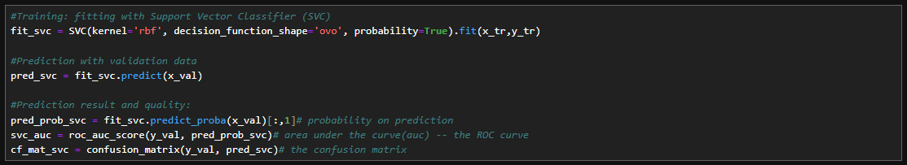

# ML-Wine-Quality-Prediction
This is a machine learning project that aims to classify the good/bad wine base on costumized setting on the wine quality.

The description and the datasets can be accessed here:

https://archive.ics.uci.edu/dataset/186/wine+quality

Please not that only **white** wine data is used here.

The project will be presented in the following structure:

**1. Data Access**

**2. Data Visualization**
   
**3. Data Preparation**
   
**4. XGB Classifier**   

**5. GBM Classifier**   

**6. ROC curves analysis**

## 1. Data Access
First of all, let's load up the dataset. Note that a data point will be droped if there is any missing piece within a client's data.

## 1. Binary Classification

## 2. Multi-class Classification

