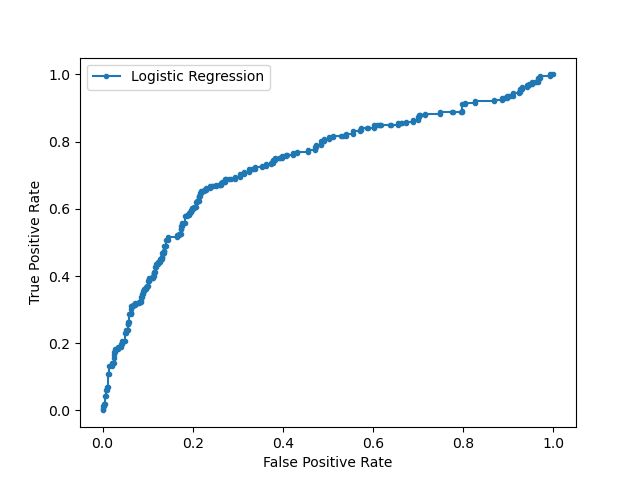

# ML-Wine-Quality-Prediction
This is a project of a graduated level machine learning course that aims to classify good/bad wine base on costum setting (by the user) on the wine quality. The project was originally finished in R (check it out!) but it was improved and written in python language (shown here).

The description and the datasets can be accessed here:

https://archive.ics.uci.edu/dataset/186/wine+quality

Please not that only **white** wine data is used here.

The project will be presented into two parts: 1. Binary classification. 2. Mulitclass Classification
In general, the structure follows:

**1. Data Access and threshold setting**

**2. Data Visualization**
   
**3. Data Preparation**
   
**4. Logistic Regression Approach**   

**5. Random Forest Approach**   

**6. Support Vector Classifier Approach**

## 1. Binary Classification

The feature of this project is returning "good/bad" label for each wine, and the "standard" is set by the user. The reason behind is simply: common people might not be able to quantify the quality for a bottle of wine (like a professonal wine taster!), this might help them to roughly know which wine might fit their need in the future.

One of the feature is "quality" (from 1 to 10, where 10 is perfect) of the wine, we simply set a threshold on this feature to distinguish the label of the wine.

First of all, we type in a number and set the threshold:

Let's say every quality higher than 6 is considered good wine. Here are all the features:

And their statistical information:

Now we apply a new feature "judge" to indicate the wine label. This feature is binary (0 means bad wine and 1 is good wine) and depends on the "quality":

According to the threshold, distributions can be visualized in every features. First of all, let's see how many "bad" and "good" wine via a pie chart:

The distributions of continuous features can be visualized via histogram. A for-loop is used to serve the purpose:

For acidity-related features:

How sweet is the wine?

How about chlorides?

The sulphur dioxide features:

The density, meaning the texture of the wine?

And the concentration of alcohol:

The only caterogrical feature is the quality of the wine:

### Data Preparation

## Logistic Regression Approach

## 2. Multi-class Classification

